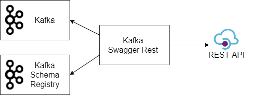

# Kafka Swagger Rest

<em>Kafka Swagger Rest is a Swagger API that allows you to send data to Kafka topics via Restful API. </em> 

It comes in handy when you want to check what topics are available in Kafka and what Schema is available for Kafka topics, or to send messages to Kafka topics using Rest API. 



# Features
* **Check topics available in Kafka**  
* **Check what schema is available for Kafka topics** 
* **Send messages to Kafka topics via Rest API** 
* **Supports 2 types of message formats for topics: plain text and Avro** 


# Getting Started

Conventions between Kafka topic name & key-value Schema name:
 
- Key schema name: "{topic}-key"
- Value schema name: "{topic}-value"

## Running From Docker Image

## Building With Docker

Steps to build Kafka Swagger Rest locally with Docker:  

1. Install prerequisites: Java and Docker
2. Clone this repository and open a terminal in the directory of the project
3. Build a Docker container with Kafka Swagger Rest
4. Start Kafka Swagger Rest  
5. Navigate to Kafka Swagger Rest in the browser

### Prerequisites

* Java 11 or newer
* Docker 

### Building

Build a Docker container with Kafka Swagger Rest: 
```sh
./mvnw clean install
``` 
 
As a result of building you'll get a Docker image: 

kafka-swagger-rest:0.1-SNAPSHOT-latest

```sh
./mvnw clean install
``` 
Start Kafka Swagger Rest:

```sh
docker-compose -f ./docker/kafka_schema-registry_kafka-swagger-rest.yml up
``` 

Open Kafka Swagger Rest in the browser:

http://localhost:8080/swagger/swagger-ui.html

# Configuration

## Configuration File

Example of how to configure your Docker Compose file - docker-compose.yml: 

```sh

    version: '2'
    services:
      kafka-swagger-rest:
        image: kafka-swagger-rest:0.1-SNAPSHOT-latest
        ports:
          - 8080:8080
        command: [ "java", "-Dreactor.netty.http.server.accessLogEnabled=true",
                   "-jar", "/kafka-swagger-rest-0.1-SNAPSHOT.jar"]
        environment:
          server.port: '8080'
    
          swagger_kafka[0]_groupName: 'localhost-kafka'
          swagger_kafka[0]_bootstrapServers: 'kafka:29092'
          swagger_kafka[0]_schemaRegistryUrl: 'http://host.docker.internal:8081'
          
          swagger.kafka[0].consumerConfig.enable.auto.commit: 'true'
          swagger.kafka[0].consumerConfig.auto.commit.interval.ms: '100'
          
          swagger.kafka[0].producerConfig.retries: '0'
          swagger.kafka[0].producerConfig.batch.size: '16384'
          
          swagger.kafka[0].topicConfig[0].topicName: 'users-avro2'
          swagger.kafka[0].topicConfig[0].autofillKeyParamName: 'ID'
          
          swagger.kafka[0].ignoreTopics: 'topicA, topicB, topicC'


```

Another example of the Docker Compose configuration file:

```sh
    version: '2'
    services:
      kafka-swagger-rest:
        image: kafka-swagger-rest:0.1-SNAPSHOT-latest
        ports:
          - 8080:8080
        command: [ "java", "-Dreactor.netty.http.server.accessLogEnabled=true",
                   "-jar", "/kafka-swagger-rest-0.1-SNAPSHOT.jar"]
        environment:
          server.port: '8080'
    
          swagger_kafka_0_groupName: 'localhost-kafka'
          swagger_kafka_0_bootstrapServers: 'kafka:29092'
          swagger_kafka_0_schemaRegistryUrl: 'http://host.docker.internal:8081'
    
          swagger_kafka_0_consumerConfig_enable_auto_commit: 'true'
          swagger_kafka_0_consumerConfig_auto_commit_interval_ms": '100'
    
          swagger_kafka_0_producerConfig_retries: '0'
          swagger_kafka_0_producerConfig_batch_size: '16384'

          swagger_kafka_0_topicConfig_0_topicName: 'users-avro2'
          swagger_kafka_0_topicConfig_0_autofillKeyParamName: 'ID'
          
          swagger_kafka_0_ignoreTopics: 'topicA, topicB, topicC'
```


* `version`: the version of docker-compose
* `services`: our container(s)
* `image`: what image is used
* `ports`: on what port a container will launch
* `command`:
* `environment`:


## Variables

| Key | Description |
| --- | ----------- |
| swagger_kafka[0]_groupName | groupName for Swagger spec |
| swagger_kafka[0]_bootstrapServers | Kafka bootstrapServers |
| swagger_kafka[0]_schemaRegistryUrl | URL to kafka-schema-registry |
| --- | --- |
| swagger.kafka[0].consumerConfig.* | Group of configs for consumer. Consumer is used to read schemas from kafka topic '_schemas'. http://kafka.apache.org/documentation.html#consumerconfigs - here you can find all config keys for consumer config |
| swagger.kafka[0].producerConfig.* | Group of configs for producer. Producer is used to send data into kafka topics. http://kafka.apache.org/documentation.html#producerconfigs - here you can find all config keys for producer config |  
| --- | --- |
| swagger.kafka[0].topicConfig[0] | Topic Config |
| swagger.kafka[0].topicConfig[0].topicName | Topic Name |
| swagger.kafka[0].topicConfig[0].autofillKeyParamName | ParamName to autofill Key from Value data. If topic message is Avro object and you want to autofill key from some field (like: ID) then you need to set this param value to "ID" and key value will be autofilled from "ID" |
| --- | --- |
| swagger_kafka_0_ignoreTopics | ignore topics list, delimiter: ',' |


